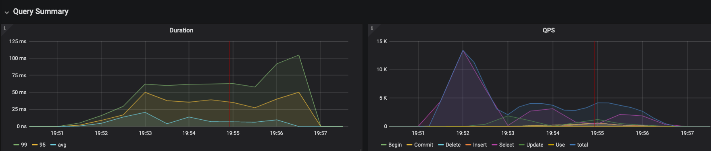
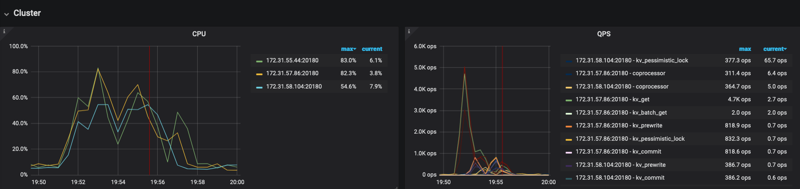
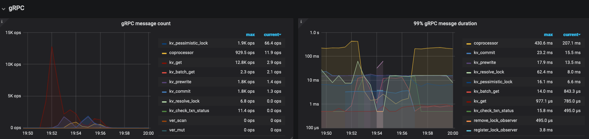
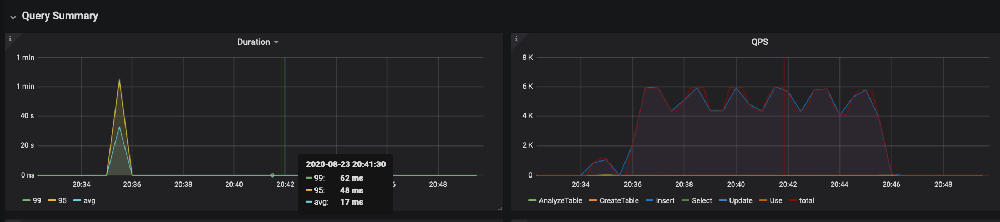
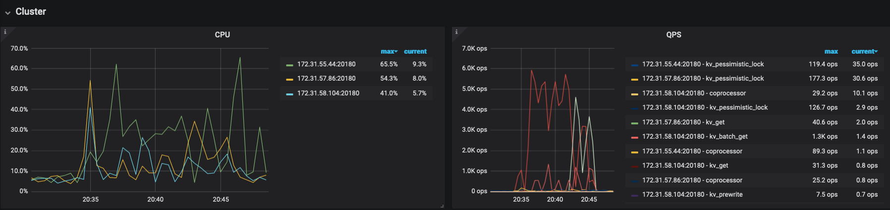
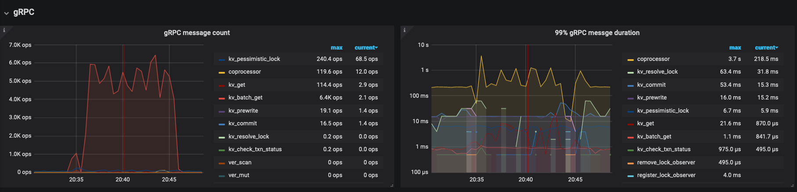
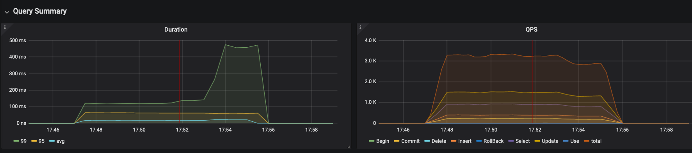
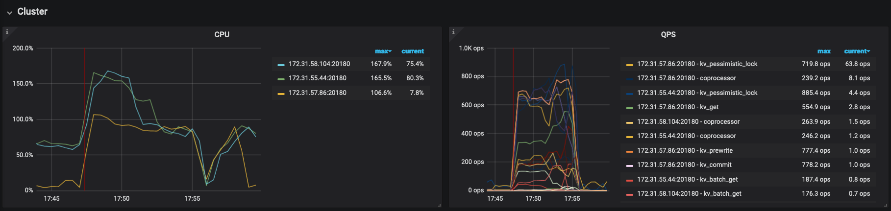
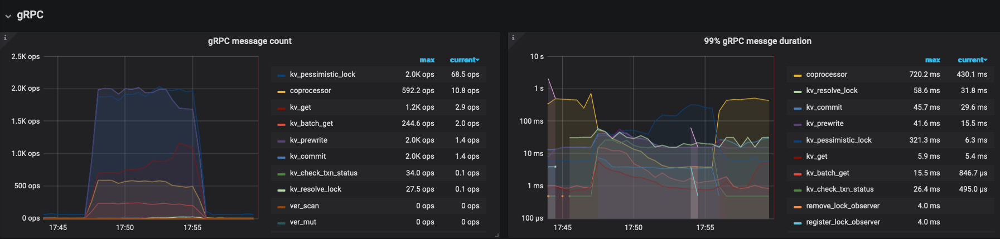

## 部署环境的机器配置
本次测试部署了PD、TiDB以及Gragana节点各一个，均部署在同一个ec2的`c5d.large`实例上，基本配置信息如下：
- CPU: 1核Intel(R) Xeon(R) Platinum 8124M CPU @ 3.00GHz
- 内存: 4G
- 硬盘: 64G SSD

部署了三个TiKV节点，分别部署到了同样配置独立的`m5d.large`实例上，基本配置信息如下：
- CPU：1核Intel(R) Xeon(R) Platinum 8175M CPU @ 2.50GHz
- 内存：8G
- 硬盘：512G SSD

### TiDB和TiKV的配置
所用机器性能不是很高，对个别线程池大小进行了适当减小：
```
server_configs:
 tidb:
   log.slow-threshold: 300
   server.mem-quota-query: 1073741824
 tikv:
   readpool.storage.use-unified-pool: false
   readpool.coprocessor.use-unified-pool: true
   server.grpc-concurrency: 2
   raftdb.max-background-jobs: 4
   rocksdb.max-background-jobs: 4
   rocksdb.max-sub-compactions: 2
 pd:
   replication.enable-placement-rules: true
```
## 测试
### sysbench测试
本次共使用`sysbench`对`oltp_point_select`、`oltp_update_index`、`oltp_read_only`、`oltp_write_only`、
`oltp_read_write`五种场景进行了测试, 每个场景又分别使用线程数8、16、32、64、128进行测试，测试输出可见[结果](./sysbench/sysbench_test_out)，汇总情况如下：
| type              | thread | qps      | p95    |
|-------------------|--------|----------|--------|
| oltp_point_select | 8      | 12653.13 | 1.25   |
| oltp_point_select | 16     | 13457.78 | 2.61   |
| oltp_point_select | 32     | 13756.17 | 5.37   |
| oltp_point_select | 64     | 15009.02 | 9.91   |
| oltp_point_select | 128    | 14823.17 | 19.65  |
| oltp_update_index | 8      | 599.57   | 17.01  |
| oltp_update_index | 16     | 1076.19  | 20.74  |
| oltp_update_index | 32     | 1870.86  | 25.28  |
| oltp_update_index | 64     | 2986.31  | 34.95  |
| oltp_update_index | 128    | 4083.41  | 52.89  |
| oltp_read_only    | 8      | 4666.85  | 46.63  |
| oltp_read_only    | 16     | 4736.94  | 86.00  |
| oltp_read_only    | 32     | 4840.51  | 155.80 |
| oltp_read_only    | 64     | 4896.56  | 277.21 |
| oltp_read_only    | 128    | 1742.86  | 539.71 |
| oltp_write_only   | 8      | 1378.71  | 43.49  |
| oltp_write_only   | 16     | 2463.43  | 51.02  |
| oltp_write_only   | 32     | 4186.23  | 65.65  |
| oltp_write_only   | 64     | 5963.40  | 102.97 |
| oltp_write_only   | 128    | 6567.12  | 204.11 |
| oltp_read_write   | 8      | 3150.27  | 73.13  |
| oltp_read_write   | 16     | 4197.02  | 112.67 |
| oltp_read_write   | 32     | 4292.39  | 215.44 |
| oltp_read_write   | 64     | 4378.48  | 404.61 |
| oltp_read_write   | 128    | 4306.47  | 759.88 |
#### TiDB Query Summary中的qps与duration

#### TiKVDetails面板中Cluster中各server的CPU以及QPS指标

#### TiKV Details面板中grpc的qps以及duration

#### 结果分析
TiKV的CPU使用率相对一般，可能可以适当提高线程池数量来优化。

### go-ycsb测试
本次使用`go-ycsb`设置128个线程并发对`workloada`~`workloadf`进行了测试，测试具体输出可见[结果](./ycsb/ycsb_test_out)，汇总情况如下：
| workload  | OP type           | OPS    | P99(us) |
|-----------|-------------------|--------|---------|
| workloada | INSERT            | 5208.6 | 62000   |
| workloada | READ              | 1558.1 | 68000   |
| workloada | UPDATE            | 1243.0 | 135000  |
| workloadb | INSERT            | 5214.2 | 63000   |
| workloadb | READ              | 3723.8 | 87000   |
| workloadb | UPDATE            | 182.8  | 116000  |
| workloadc | INSERT            | 5183.4 | 61000   |
| workloadc | READ              | 7273.1 | 87000   |
| workloadd | INSERT            | 5243.8 | 61000   |
| workloadd | INSERT            | 215.3  | 87000   |
| workloadd | INSERT            | 4136.0 | 85000   |
| workloade | INSERT            | 5052.6 | 64000   |
| workloade | INSERT            | 60.7   | 120000  |
| workloade | SCAN              | 1577.3 | 153000  |
| workloadf | INSERT            | 5075.6 | 64000   |
| workloadf | READ              | 1963.0 | 99000   |
| workloadf | READ_MODIFY_WRITE | 1411.1 | 161000  |
| workloadf | UPDATE            | 1410.8 | 99000   |
#### TiDB Query Summary中的qps与duration

#### TiKV Details面板中Cluster中各server的CPU以及QPS指标

#### TiKV Details面板中grpc的qps以及duration

#### 结果分析
根据观察发现，TiKV上CPU和内存使用率都不是很高，但是memtable hit率基本处于20%附近，因此猜测性能瓶颈可能跟memtable过小有关。同时线程池可能过小。


### tpcc测试
使用64个线程分别对500、128、32、8个warehouses场景进行测试，结果如下：
500 warehouses:
```txt
DELIVERY - Takes(s): 117.9, Count: 988, TPM: 502.8, Sum(ms): 1050461, Avg(ms): 1063, 95th(ms): 1500, 99th(ms): 2000, 99.9th(ms): 4000
DELIVERY_ERR - Takes(s): 0.0, Count: 12, TPM: 17469.4, Sum(ms): 4867, Avg(ms): 405, 95th(ms): 1000, 99th(ms): 1000, 99.9th(ms): 1000
NEW_ORDER - Takes(s): 118.8, Count: 12042, TPM: 6081.6, Sum(ms): 3650513, Avg(ms): 303, 95th(ms): 512, 99th(ms): 512, 99.9th(ms): 1000
NEW_ORDER_ERR - Takes(s): 0.0, Count: 26, TPM: 37893.6, Sum(ms): 1845, Avg(ms): 70, 95th(ms): 160, 99th(ms): 160, 99.9th(ms): 160
ORDER_STATUS - Takes(s): 118.9, Count: 1086, TPM: 547.9, Sum(ms): 115710, Avg(ms): 106, 95th(ms): 256, 99th(ms): 256, 99.9th(ms): 1000
ORDER_STATUS_ERR - Takes(s): 0.0, Count: 3, TPM: 4433.0, Sum(ms): 60, Avg(ms): 20, 95th(ms): 24, 99th(ms): 24, 99.9th(ms): 24
PAYMENT - Takes(s): 118.9, Count: 11654, TPM: 5882.0, Sum(ms): 2642431, Avg(ms): 226, 95th(ms): 512, 99th(ms): 512, 99.9th(ms): 1000
PAYMENT_ERR - Takes(s): 0.0, Count: 7, TPM: 10216.5, Sum(ms): 345, Avg(ms): 49, 95th(ms): 112, 99th(ms): 112, 99.9th(ms): 112
STOCK_LEVEL - Takes(s): 118.9, Count: 1149, TPM: 579.6, Sum(ms): 145598, Avg(ms): 126, 95th(ms): 256, 99th(ms): 256, 99.9th(ms): 1000
STOCK_LEVEL_ERR - Takes(s): 0.0, Count: 1, TPM: 1482.4, Sum(ms): 22, Avg(ms): 22, 95th(ms): 24, 99th(ms): 24, 99.9th(ms): 24
```
128 warehouses:
```txt
DELIVERY - Takes(s): 117.9, Count: 1075, TPM: 547.0, Sum(ms): 1133898, Avg(ms): 1054, 95th(ms): 1500, 99th(ms): 2000, 99.9th(ms): 4000
DELIVERY_ERR - Takes(s): 0.1, Count: 9, TPM: 9544.8, Sum(ms): 4403, Avg(ms): 489, 95th(ms): 1000, 99th(ms): 1000, 99.9th(ms): 1000
NEW_ORDER - Takes(s): 118.8, Count: 12175, TPM: 6147.9, Sum(ms): 3581410, Avg(ms): 294, 95th(ms): 512, 99th(ms): 1000, 99.9th(ms): 1000
NEW_ORDER_ERR - Takes(s): 0.1, Count: 31, TPM: 32828.9, Sum(ms): 4365, Avg(ms): 140, 95th(ms): 256, 99th(ms): 512, 99.9th(ms): 512
ORDER_STATUS - Takes(s): 118.8, Count: 1099, TPM: 554.9, Sum(ms): 117242, Avg(ms): 106, 95th(ms): 256, 99th(ms): 256, 99.9th(ms): 512
ORDER_STATUS_ERR - Takes(s): 0.1, Count: 1, TPM: 1078.8, Sum(ms): 95, Avg(ms): 95, 95th(ms): 96, 99th(ms): 96, 99.9th(ms): 96
PAYMENT - Takes(s): 119.1, Count: 11620, TPM: 5852.1, Sum(ms): 2653346, Avg(ms): 228, 95th(ms): 512, 99th(ms): 512, 99.9th(ms): 1000
PAYMENT_ERR - Takes(s): 0.1, Count: 14, TPM: 14859.3, Sum(ms): 1396, Avg(ms): 99, 95th(ms): 192, 99th(ms): 192, 99.9th(ms): 192
STOCK_LEVEL - Takes(s): 118.8, Count: 1066, TPM: 538.2, Sum(ms): 118456, Avg(ms): 111, 95th(ms): 256, 99th(ms): 256, 99.9th(ms): 512
```
32 warehouses:
```txt
DELIVERY - Takes(s): 118.2, Count: 1076, TPM: 546.4, Sum(ms): 1098209, Avg(ms): 1020, 95th(ms): 2000, 99th(ms): 4000, 99.9th(ms): 4000
DELIVERY_ERR - Takes(s): 0.0, Count: 7, TPM: 9389.5, Sum(ms): 5285, Avg(ms): 755, 95th(ms): 1500, 99th(ms): 1500, 99.9th(ms): 1500
NEW_ORDER - Takes(s): 118.8, Count: 11943, TPM: 6030.6, Sum(ms): 3410114, Avg(ms): 285, 95th(ms): 512, 99th(ms): 1000, 99.9th(ms): 1000
NEW_ORDER_ERR - Takes(s): 0.0, Count: 19, TPM: 25289.5, Sum(ms): 2940, Avg(ms): 154, 95th(ms): 512, 99th(ms): 512, 99.9th(ms): 512
ORDER_STATUS - Takes(s): 119.2, Count: 1085, TPM: 546.3, Sum(ms): 101686, Avg(ms): 93, 95th(ms): 192, 99th(ms): 256, 99.9th(ms): 512
ORDER_STATUS_ERR - Takes(s): 0.0, Count: 2, TPM: 2732.4, Sum(ms): 189, Avg(ms): 94, 95th(ms): 128, 99th(ms): 128, 99.9th(ms): 128
PAYMENT - Takes(s): 119.1, Count: 11373, TPM: 5728.6, Sum(ms): 2884447, Avg(ms): 253, 95th(ms): 512, 99th(ms): 1000, 99.9th(ms): 1000
PAYMENT_ERR - Takes(s): 0.0, Count: 21, TPM: 27974.1, Sum(ms): 3547, Avg(ms): 168, 95th(ms): 512, 99th(ms): 512, 99.9th(ms): 512
STOCK_LEVEL - Takes(s): 119.3, Count: 1121, TPM: 563.6, Sum(ms): 109636, Avg(ms): 97, 95th(ms): 192, 99th(ms): 256, 99.9th(ms): 512
```

8 warehouses:
```txt
DELIVERY - Takes(s): 118.4, Count: 992, TPM: 502.6, Sum(ms): 608873, Avg(ms): 613, 95th(ms): 1500, 99th(ms): 2000, 99.9th(ms): 4000
DELIVERY_ERR - Takes(s): 0.0, Count: 4, TPM: 8895.3, Sum(ms): 2668, Avg(ms): 667, 95th(ms): 2000, 99th(ms): 2000, 99.9th(ms): 2000
NEW_ORDER - Takes(s): 119.0, Count: 10439, TPM: 5264.2, Sum(ms): 2849278, Avg(ms): 272, 95th(ms): 1000, 99th(ms): 1500, 99.9th(ms): 2000
NEW_ORDER_ERR - Takes(s): 0.0, Count: 20, TPM: 43882.8, Sum(ms): 5800, Avg(ms): 290, 95th(ms): 1000, 99th(ms): 1000, 99.9th(ms): 1000
ORDER_STATUS - Takes(s): 119.3, Count: 878, TPM: 441.7, Sum(ms): 33245, Avg(ms): 37, 95th(ms): 96, 99th(ms): 128, 99.9th(ms): 512
ORDER_STATUS_ERR - Takes(s): 0.0, Count: 1, TPM: 2184.1, Sum(ms): 68, Avg(ms): 68, 95th(ms): 80, 99th(ms): 80, 99.9th(ms): 80
PAYMENT - Takes(s): 119.2, Count: 9921, TPM: 4995.6, Sum(ms): 4069528, Avg(ms): 410, 95th(ms): 1000, 99th(ms): 1500, 99.9th(ms): 4000
PAYMENT_ERR - Takes(s): 0.0, Count: 29, TPM: 63440.3, Sum(ms): 8427, Avg(ms): 290, 95th(ms): 1000, 99th(ms): 1000, 99.9th(ms): 1000
STOCK_LEVEL - Takes(s): 119.1, Count: 933, TPM: 470.1, Sum(ms): 40982, Avg(ms): 43, 95th(ms): 96, 99th(ms): 128, 99.9th(ms): 512
```
#### TiDB Query Summary中的qps与duration

#### TiKV Details面板中Cluster中各server的CPU以及QPS指标

#### TiKV Details面板中grpc的qps以及duration

#### 结果分析
总体来看，TiKV上CPU利用率都比较高，但是内存使用并不是非常充分，同时观察发现memtable hit率在任务开始时也达到80%左右，在后来才降低到50%左右，看上去更像CPU overhead。

### tpch测试
测试时遇到错误，未能完成测试，从dashboard搜索到错误信息如下：
```
[conn.go:744] ["command dispatched failed"] [conn=82] [connInfo="id:82, addr:172.31.58.100:41602 status:10, collation:utf8_general_ci, user:root"] [command=Query] [status="inTxn:0, autocommit:1"] [sql="\nselect\n\ts_acctbal,\n\ts_name,\n\tn_name,\n\tp_partkey,\n\tp_mfgr,\n\ts_address,\n\ts_phone,\n\ts_comment\nfrom\n\tpart,\n\tsupplier,\n\tpartsupp,\n\tnation,\n\tregion\nwhere\n\tp_partkey = ps_partkey\n\tand s_suppkey = ps_suppkey\n\tand p_size = 30\n\tand p_type like '%STEEL'\n\tand s_nationkey = n_nationkey\n\tand n_regionkey = r_regionkey\n\tand r_name = 'ASIA'\n\tand ps_supplycost = (\n\t\tselect\n\t\t\tmin(ps_supplycost)\n\t\tfrom\n\t\t\tpartsupp,\n\t\t\tsupplier,\n\t\t\tnation,\n\t\t\tregion\n\t\twhere\n\t\t\tp_partkey = ps_partkey\n\t\t\tand s_suppkey = ps_suppkey\n\t\t\tand s_nationkey = n_nationkey\n\t\t\tand n_regionkey = r_regionkey\n\t\t\tand r_name = 'ASIA'\n\t)\norder by\n\ts_acctbal desc,\n\tn_name,\n\ts_name,\n\tp_partkey\nlimit 100;\n"] [txn_mode=PESSIMISTIC] [err="write tcp 172.31.58.100:4000->172.31.58.100:41602: write: connection reset by peer\ngithub.com/pingcap/errors.AddStack\n\t/home/jenkins/agent/workspace/tidb_master/go/pkg/mod/github.com/pingcap/errors@v0.11.5-0.20200729012136-4e113ddee29e/errors.go:174\ngithub.com/pingcap/errors.Trace\n\t/home/jenkins/agent/workspace/tidb_master/go/pkg/mod/github.com/pingcap/errors@v0.11.5-0.20200729012136-4e113ddee29e/juju_adaptor.go:15\ngithub.com/pingcap/tidb/server.(*packetIO).flush\n\t/home/jenkins/agent/workspace/tidb_master/go/src/github.com/pingcap/tidb/server/packetio.go:181\ngithub.com/pingcap/tidb/server.(*clientConn).flush\n\t/home/jenkins/agent/workspace/tidb_master/go/src/github.com/pingcap/tidb/server/conn.go:987\ngithub.com/pingcap/tidb/server.(*clientConn).writeResultset\n\t/home/jenkins/agent/workspace/tidb_master/go/src/github.com/pingcap/tidb/server/conn.go:1565\ngithub.com/pingcap/tidb/server.(*clientConn).handleStmt\n\t/home/jenkins/agent/workspace/tidb_master/go/src/github.com/pingcap/tidb/server/conn.go:1466\ngithub.com/pingcap/tidb/server.(*clientConn).handleQuery\n\t/home/jenkins/agent/workspace/tidb_master/go/src/github.com/pingcap/tidb/server/conn.go:1336\ngithub.com/pingcap/tidb/server.(*clientConn).dispatch\n\t/home/jenkins/agent/workspace/tidb_master/go/src/github.com/pingcap/tidb/server/conn.go:925\ngithub.com/pingcap/tidb/server.(*clientConn).Run\n\t/home/jenkins/agent/workspace/tidb_master/go/src/github.com/pingcap/tidb/server/conn.go:727\ngithub.com/pingcap/tidb/server.(*Server).onConn\n\t/home/jenkins/agent/workspace/tidb_master/go/src/github.com/pingcap/tidb/server/server.go:421\nruntime.goexit\n\t/usr/local/go/src/runtime/asm_amd64.s:1357"]
```
